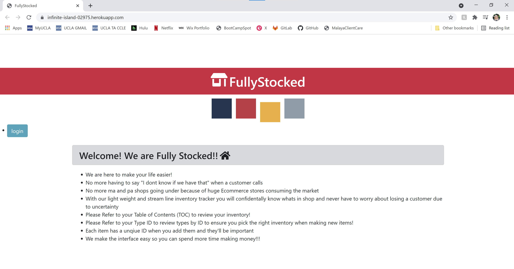
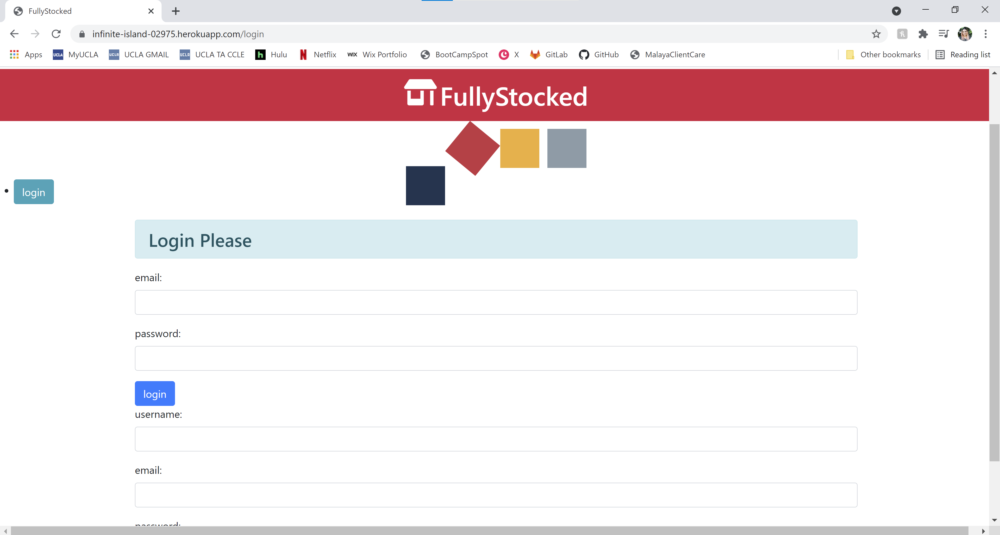

# FullStocked
> FullyStocked, is a simple inventory application that allows Users to Add, Delete, and Restock their inventory.

> Live demo [_here_](https://infinite-island-02975.herokuapp.com/)
 
## Table of Contents
* [General Info](#general-information)
* [Technologies Used](#technologies-used)
* [Features](#features)
* [Screenshots](#screenshots)
* [Usage](#usage)
* [Project Status](#project-status)

## General Information
- Provide general information about your project here.
- Streamlining inventory management in new and/or small businesses is key to successful operations.
- Yet, inventory management software can come at a hefty price.
- FullyStocked allows you or your employee create a Username + Login. Each User can then Add and Delete inventory

## Technologies Used
- Sequelize ORM
- RESTful APIs
- Node.js
- Express.js
- Handlebars.js
- Anime.js
- FontAwesome
- MVC

## Features
List the ready features here:
- Create Username with User email and unique password 
- ADD Items, Price, Quantity, and ItemID 
- Delete Item and ItemIDs

## Screenshots

## Usage
Create a login with an email and unique password. Add your inventory by adding items. Each item has a unique ID when you add them. 
Refer to TypeIDs to review types to ensure you tag your stock correctly. 